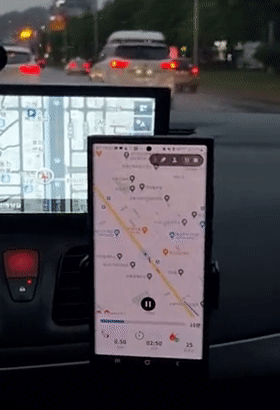

## 🏃🏻‍♂️ RunWithMe?

RunWithMe는 Android 모바일로 제공되는 비대면 러닝 챌린지 어플리케이션입니다. 동기 부여를 얻기 위해 러닝 크루에 참가한다는 소비자의 니즈를 파악하고 동기 부여에 초점을 맞춘 차별화된 어플리케이션입니다.
 
포인트를 내고 챌린지에 가입하고 챌린지 기간 동안 목표를 달성해야 합니다. 7월 1일부터 7월 21일까지 3주 간의 기간 동안, 목표가 주 3회 거리 3km 라면 3주 동안 매주 3번 이상 3km를 달려야 목표에 성공합니다.
 

사용자로 하여금 어플을 통해 **동기부여 받는 것을 최우선으로 노력**했습니다.
1. **짧은 기간부터 설정**할 수 있게 했습니다. 해당 앱은 크루 내의 목표 거리 또는 목표 시간을 목표 날만큼 채워야만 챌린지에 성공하고 포인트를 돌려받을 수 있는 서비스였습니다. 목표는 기간이 길어지면 해이해질 수 있다고 생각하여 짧은 기간 부터 설정할 수 있게 하였고 너무 긴 기간은 잡을 수 없도록 했습니다.
2. **비정상적인 움직임을 막았습니다**. 동기부여를 더 강화하기 위해 챌린지 크루 내에서도 랭킹을 두었는데 집에서 러닝을 켜두기만 한 채 시간을 채우거나 차를 이용하여 비정상적으로 거리를 늘리는 행위를 고려하여 기능을 개발하였습니다. 신호등에 멈추는 경우를 생각하여 다시 러닝을 시작하면 자동으로 다시 러닝이 재개되도록 하였습니다.
3. **기록 공유**입니다. 최근 “오운완”이라는 태그를 통해 서로 운동을 인증하며 동기부여를 얻는 방식이 유행하고 있습니다. 챌린지 크루 내의 사람들과 건강한 동기부여를 부여하기 위해 러닝 완료 후 기록을 자동으로 공유되게 하여 동기부여를 얻도록 했습니다.

 
경로 최적화를 적용하여 좌표 데이터를 약 73% 감소했습니다.
 

## 1. 경로 최적화 적용

### 최적화 알고리즘
 
[최적화 알고리즘에 대한 설명 더 자세히 보기(링크)](https://gyeongwons.tistory.com/76)

GPS 오차 떄문에 직선 거리가 부정확하고 좌표가 너무 많아지는 문제가 발생했습니다.  
도로 정보가 없는 경우나 건물 사이를 이동할 수 없는 러닝 환경 때문에 도로 네트웍을 매칭시키는 맵 매칭 방식보다는 경로 방향을 고려한 최적화 방법을 고안했습니다.  
경로를 그리는 데에 크게 영향을 미치지 않는 너무 가까운 좌표, 진행 방향에서 각도가 완만한 좌표를 제외하여 직선거리를 더 정확하게 나타내었고 기존 좌표 데이터 175개를 46개로 약 73% 감소했습니다.  
진행 방향에서 거리에 따라 완만하게 보는 각도를 조절하였고 WGS84 좌표 체계를 사용한 Location 클래스를 활용하여 정확한 거리, 각도를 계산하여 최적화를 했습니다.  
  

### 적용 화면

 

## 2. 비정상적인 움직임 감지 화면(자동차)

